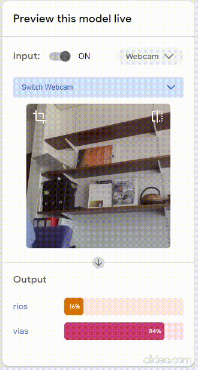
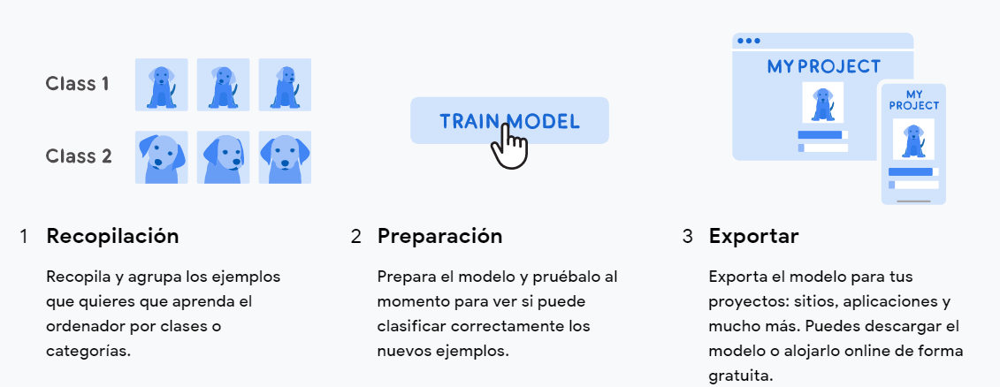
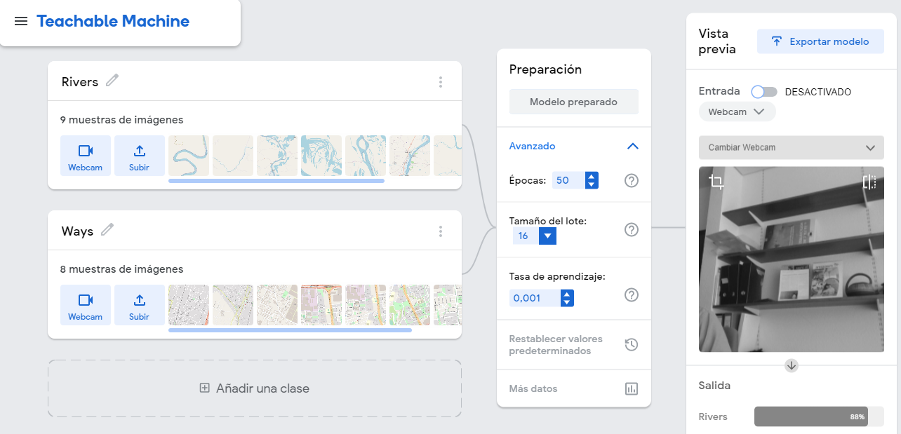

# teachablemachine: ¨aplicaciones sobre mapas¨

Imagine un modelo de IA que clasifique de manera automática cualquier vía o camino de un rio o drenaje al mirar un mapa o imagen de satélite: 

</img>
 

Este es un ejemplo sencillo desarrollado en **[Teachable Machine](https://teachablemachine.withgoogle.com/)** que muestra la forma rápida de crear modelos de aprendizaje profundo o automático en aplicaciones geográficas [Deep learning mapping](https://towardsdatascience.com/deep-learning-for-visual-searches-and-mapping-89b85061ef9e).
**Teachable Machine** es una herramienta basada en la Web que hace posible crear modelos de aprendizaje automático de manera rápida.
## Como funciona:

</img>
 

El modelo funciona a partir de una serie de imágenes creadas y precargadas sobre capas de [OPS](https://blog.openstreetmap.org/category/operations/) openstreetmap, que le enseña a un modelo de **[IA](https://towardsdatascience.com/search?q=Artificial%20inteligent)** a clasificar imágenes en dos clases: 
* 1. Rios
* 2. Vias

El modelo puede clasificar cualquier imagen utilizando para ello archivos de tu PC o tu webcam como datos de entrada.

</img>
 

## Enlace de ejemplo:

**[script OPS](https://teachablemachine.withgoogle.com/models/dhroGiDRg/)**
    
## Descarga el modelo:
El modelo sobre [OPS](https://blog.openstreetmap.org/category/operations/) presentado, fue desarrollado bajo TensorFlow.js que funciona en cualquier sitio con javascript. Por tanto, es perfectamente compatible con herramientas como [Glitch](https://glitch.com/), [P5.js](https://p5js.org/), [Node.js](https://nodejs.org/es/) y muchas otras. puedes descargarlo aqui:
* [Script](https://code.earthengine.google.com/839e29e8409b509c703ff2718818979b)

----------------------------------------------------

Teachable Machine Image Model

<button type="button" onclick="init()">Start</button>

<script type="text/javascript">
    // More API functions here:
    // https://github.com/googlecreativelab/teachablemachine-community/tree/master/libraries/image
 
--------------------------------------------------------------------------------------------------
